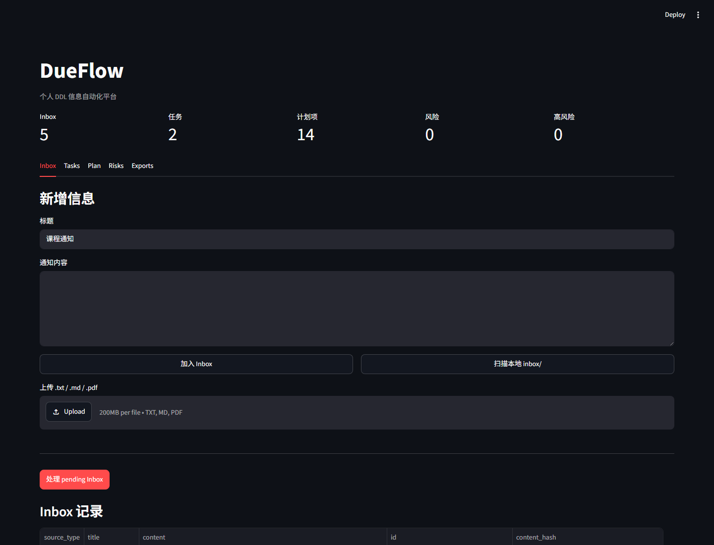

<div align="center">
  
  <h1>DueFlow</h1>
  <p><strong>Turn scattered deadline information into an actionable schedule—locally.</strong></p>
  <p>A local-first deadline assistant with OCR-ready intake, LLM extraction, risk checks, calendar exports, and a Tauri desktop pet.</p>
</div>

<p align="center">
  <a href="https://github.com/Ustinian5/DueFlow/actions/workflows/test.yml"></a>
  <a href="https://ustinian5.github.io/DueFlow/"></a>
  
  
  
  <a href="LICENSE"></a>
</p>

<p align="center">
  <a href="https://ustinian5.github.io/DueFlow/">Project site</a> ·
  <a href="#60-second-local-demo">60-second demo</a> ·
  <a href="#desktop-development">Desktop development</a> ·
  <a href="docs/product_requirements.md">Product requirements</a> ·
  <a href="ROADMAP.md">Roadmap</a> ·
  <a href="CONTRIBUTING.md">Contributing</a>
</p>



DueFlow turns screenshots, files, notifications, pasted text, and webhook payloads into an Inbox. It extracts deadline tasks with an LLM-compatible provider, then generates editable schedules, reverse plans, risk checks, reminders, Markdown reports, and calendar files.

> **Try it without an API key.** The default `mock` provider runs the complete local demo deterministically.

## Why DueFlow

| What you have | What DueFlow produces |
|---|---|
| Course notices, internship emails, competition announcements | Structured tasks with deadlines, deliverables, and submission details |
| Screenshots, PDFs, Markdown, text files, webhook payloads | One deduplicated local Inbox with source references |
| A deadline and too many unknowns | Reverse plans, missing-information checks, and risk flags |
| A schedule you need elsewhere | Editable Markdown, todo lists, summaries, and calendar `.ics` exports |

## Highlights

- **Local-first by default** — SQLite data, Inbox files, exports, backups, and diagnostics stay on your machine.
- **Multiple intake paths** — text, Markdown, PDF, OCR-ready images, file drops, local Inbox scanning, and webhooks.
- **Actionable extraction** — deadlines, deliverables, submission methods, missing information, and source quotes.
- **Planning, not just parsing** — editable schedule items, reverse plans, risk checks, reminders, and exports.
- **Desktop companion** — a Tauri 2 shell with a transparent always-on-top pet and a separate schedule surface.
- **Reproducible verification** — mock-provider tests, desktop smoke tests, backup/restore checks, and release gates.

## 60-Second Local Demo

```bash
git clone https://github.com/Ustinian5/DueFlow.git
cd DueFlow
conda env create -f environment.yml
conda run -n dueflow python scripts/run_demo.py
```

Expected result:

```text
DueFlow demo completed
processed=3 tasks=3 plans=17 risks=5
```

Generated files appear in `exports/`, including `todo.md`, `plan.md`, `summary.md`, `calendar.ics`, and `submission_report.md`.

## Current Status

DueFlow `0.1.1` is ready for local development and open-source review. macOS packaging is implemented as a zipped `.app` bundle. Developer ID signing, notarization, and DMG distribution are documented in the release guide.

The desktop architecture uses its own Tauri/Python/React implementation. OpenPets is referenced for interaction and architecture research only. DueFlow does not depend on OpenPets and does not import its packages, code, or assets.

## Architecture

```text
Inputs
  -> Desktop API / Webhook / Streamlit / Desktop Pet
  -> Inbox + deduplication
  -> parser and optional OCR
  -> LLM extraction
  -> automatic SQLite tasks/plans/risks
  -> reminders, exports, diagnostics and desktop pet state
```

Main components:

- `api/desktop.py`: local FastAPI desktop API used by the Tauri frontend.
- `api/webhook.py`: smaller webhook API for external payloads.
- `src/`: core database, parsing, extraction, planning, risk, export and pet-state logic.
- `desktop/`: Tauri 2 + React desktop shell.
- `desktop/src/PetOverlay.tsx`: desktop pet overlay.
- `desktop/src/petRuntime.ts`: event-driven pet state and action runtime.
- `desktop/src/skillRegistry.ts`: local skill manifest validation.
- `desktop/src/petManifest.ts`: local desktop pet appearance validation and runtime resolution.
- `docs/`: desktop API, release process, product plan and OpenPets reference notes.

## Requirements

- Python 3.11
- Node.js 20 or newer
- Rust stable toolchain
- Conda is recommended for the Python environment
- macOS for local `.app` packaging

Linux CI or local Rust checks for Tauri may need GTK/WebKit dependencies. See `.github/workflows/test.yml` for the current package list.

## Quick Start

Create the Python environment:

```bash
conda env create -f environment.yml
conda activate dueflow
```

Or install with pip:

```bash
python -m venv .venv
source .venv/bin/activate
python -m pip install -r requirements.txt
```

For editable Python package metadata:

```bash
python -m pip install -e ".[dev]"
```

Create local configuration:

```bash
cp .env.example .env
```

The default `.env.example` uses:

```env
LLM_PROVIDER=mock
DATABASE_PATH=dueflow.db
INBOX_PATH=inbox
EXPORT_PATH=exports
```

Image and screenshot intake requires OCR. On macOS, DueFlow can use the local Vision framework. On other systems, or when overriding the default, set `DUEFLOW_OCR_COMMAND`, for example:

```env
DUEFLOW_OCR_COMMAND=tesseract {path} stdout -l chi_sim+eng
```

Run the core tests:

```bash
python -m pytest
```

Run the command-line demo:

```bash
python scripts/run_demo.py
```

## Desktop Development

Install frontend dependencies:

```bash
cd desktop
npm install
```

Run the local desktop API:

```bash
conda run -n dueflow python -m uvicorn api.desktop:app --host 127.0.0.1 --port 8000
```

Run the frontend in browser development mode:

```bash
cd desktop
npm run dev
```

Run the full Tauri shell:

```bash
cd desktop
npm run tauri:dev
```

The shell opens:

- `main`: the full DDL workbench.
- `pet`: a transparent always-on-top desktop pet window rendered from `index.html?view=pet`.

The Tauri shell can also autostart the local API. Runtime paths are stored in the platform app data directory instead of the repository.

## Verification

Run these before submitting a pull request:

```bash
python -m pytest

cd desktop
npm run build
npm run test:runtime
npm run test:smoke
npm run test:preflight
npm run test:release-manifest

cd src-tauri
cargo fmt --check
cargo check
cargo test
```

What the gates cover:

- `pytest`: Python pipeline, database, desktop API, packaging metadata and webhook behavior.
- `npm run build`: TypeScript and Vite production build.
- `npm run test:runtime`: pet runtime, event bridge, reminders, local skills and pet manifest logic.
- `npm run test:smoke`: isolated desktop API smoke test with temporary data; validates file intake, duplicate detection, task generation, exports, backup/restore, diagnostics privacy and Tauri window config.
- `cargo test`: Tauri shell helper logic, including local pet import source confinement, asset copying and rollback.

## Release

For local macOS packaging:

```bash
cd desktop
npm run release:mac
```

The release script runs preflight checks, builds the Tauri app, verifies the `.app` bundle, then writes:

- `desktop/release/DueFlow-Desktop_<version>_<arch>_<timestamp>.app.zip`
- `desktop/release/*.sha256`
- `desktop/release/*.manifest.json`

See [docs/desktop_release.md](docs/desktop_release.md) for the full release gate, signing and notarization notes.
Use [docs/release_checklist.md](docs/release_checklist.md) before publishing a GitHub release or handing off a build.

## Local Data And Privacy

DueFlow is local-first:

- SQLite database, Inbox files, exports, backups and diagnostics stay on the user's machine.
- Real model providers are optional and configured by the user.
- Diagnostics intentionally omit raw Inbox text, task titles, source quotes and extracted descriptions.
- `.env`, databases, local Inbox files and release artifacts are ignored by Git.

See [PRIVACY.md](PRIVACY.md) for model-provider, OCR, diagnostics and local asset privacy boundaries.

## OpenPets Reference Boundary

OpenPets is used only as a reference sample for:

- event-driven interaction;
- derived pet state;
- action registration;
- plugin/manifest isolation;
- separation between pet window, control surface and desktop shell.

DueFlow does not import OpenPets packages, copy its source, reuse its assets, or adopt its Electron runtime. See [docs/openpets_reference_notes.md](docs/openpets_reference_notes.md).

## Documentation

- [Current product requirements](docs/product_requirements.md)
- [Desktop API](docs/desktop_api.md)
- [Desktop release](docs/desktop_release.md)
- [Release checklist](docs/release_checklist.md)
- [Changelog](CHANGELOG.md)
- [Roadmap](ROADMAP.md)
- [Contributing](CONTRIBUTING.md)
- [Code of conduct](CODE_OF_CONDUCT.md)
- [Support](SUPPORT.md)
- [Privacy](PRIVACY.md)
- [Security policy](SECURITY.md)
- [Current product requirements](docs/product_requirements.md)
- [Demo notes](docs/demo.md)
- [OpenPets reference notes](docs/openpets_reference_notes.md)

## Contributing

Contributions are welcome. Start with [CONTRIBUTING.md](CONTRIBUTING.md), run the verification gates above, and avoid committing private data or generated local artifacts.

## Support

Use [SUPPORT.md](SUPPORT.md) for bug reports, feature requests and support boundaries.

## Code of Conduct

Participation in DueFlow project spaces follows [CODE_OF_CONDUCT.md](CODE_OF_CONDUCT.md).

## Security

Please report vulnerabilities privately. See [SECURITY.md](SECURITY.md).

## License

DueFlow is released under the MIT License. See [LICENSE](LICENSE).
