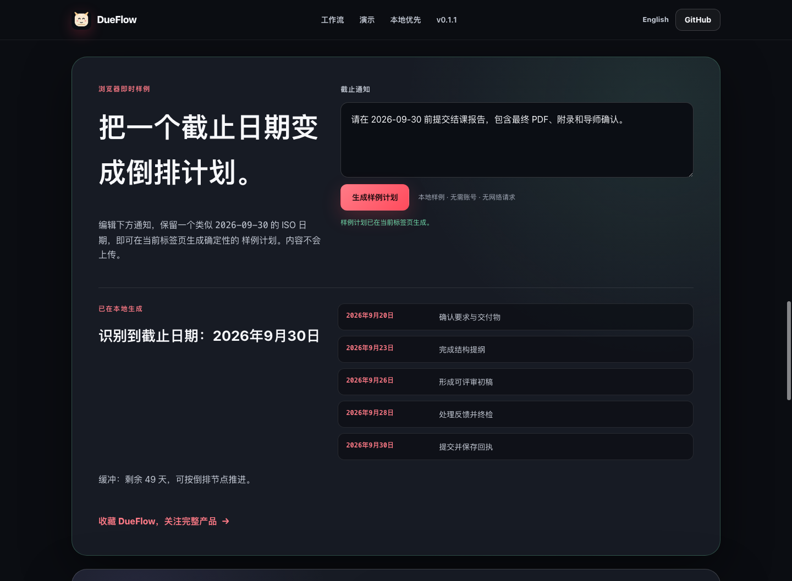

<div align="center">
  
  <h1>DueFlow</h1>
  <p><strong>在本地把分散的截止信息变成可执行日程。</strong></p>
  <p>本地优先的截止日期助手，支持 OCR 输入、LLM 提取、风险检查、日历导出和 Tauri 桌面宠物。</p>
</div>

<p align="center">
  <a href="README.md">English</a> · <strong>简体中文</strong>
</p>

<p align="center">
  <a href="https://github.com/Ustinian5/DueFlow/actions/workflows/test.yml"></a>
  <a href="https://ustinian5.github.io/DueFlow/zh/"></a>
  <a href="https://github.com/Ustinian5/DueFlow/releases/tag/v0.1.4"></a>
  
  
  
  <a href="LICENSE"></a>
</p>

<p align="center">
  <a href="https://ustinian5.github.io/DueFlow/zh/">中文项目站</a> ·
  <a href="https://github.com/Ustinian5/DueFlow/releases/tag/v0.1.4">下载预览版</a> ·
  <a href="#60-秒本地演示">60 秒演示</a> ·
  <a href="#桌面开发">桌面开发</a> ·
  <a href="docs/product_requirements.md">产品需求</a> ·
  <a href="ROADMAP.md">路线图</a> ·
  <a href="CONTRIBUTING.md">参与贡献</a>
</p>

## 无需安装，直接在浏览器试用

编辑一条截止通知，即可在浏览器中生成 5 个倒排节点和截止风险摘要。首次访问后可离线使用，还能复制计划或下载标准 `.ics` 日历；无需注册、API 密钥，也不会上传内容。

<p align="center">
  <a href="https://ustinian5.github.io/DueFlow/zh/#demo"><strong>打开 60 秒浏览器样例 →</strong></a> ·
  <a href="https://github.com/Ustinian5/DueFlow/releases/download/v0.1.4/DueFlow-Desktop_0.1.4_arm64.app.zip"><strong>下载 Apple Silicon 版</strong></a> ·
  <a href="https://github.com/Ustinian5/DueFlow/releases/download/v0.1.4/DueFlow-Desktop_0.1.4_x86_64.app.zip"><strong>下载 Intel 版</strong></a>
</p>

<a href="https://ustinian5.github.io/DueFlow/zh/#demo">
  
</a>

<p align="center"><sub>如果样例适合你的工作流，可使用 GitHub 的 Star 按钮关注后续版本。</sub></p>


DueFlow 将截图、文件、通知、粘贴文本和 Webhook 数据放入统一收件箱。它通过兼容 LLM 的提供商提取截止任务，并生成可编辑日程、倒排计划、风险检查、提醒、Markdown 报告和日历文件。

> **无需 API 密钥即可试用。** 默认 `mock` 提供商会以确定性方式运行完整本地演示。

## 为什么选择 DueFlow

| 你拥有的信息 | DueFlow 生成的结果 |
|---|---|
| 课程通知、实习邮件、竞赛公告 | 包含截止日期、交付物和提交细节的结构化任务 |
| 截图、PDF、Markdown、文本文件、Webhook 数据 | 带来源引用且已去重的统一收件箱 |
| 一个截止日期和大量未知事项 | 倒排计划、缺失信息检查和风险标记 |
| 需要放入其他工具的日程 | 可编辑 Markdown、待办清单、摘要和 `.ics` 日历导出 |

## 主要功能

- **默认本地优先** — SQLite 数据、收件箱文件、导出、备份和诊断留在本机。
- **多种输入方式** — 文本、Markdown、PDF、待 OCR 图片、拖放文件、本地收件箱扫描和 Webhook。
- **可执行的信息提取** — 截止日期、交付物、提交方式、缺失信息和来源引用。
- **不止解析，更提供规划** — 可编辑日程项、倒排计划、风险检查、提醒和导出。
- **桌面伙伴** — Tauri 2 外壳、透明置顶宠物和独立日程界面。
- **可复现验证** — mock 提供商测试、桌面冒烟测试、备份恢复检查和发布门禁。

## 60 秒本地演示

```bash
git clone https://github.com/Ustinian5/DueFlow.git
cd DueFlow
conda env create -f environment.yml
conda run -n dueflow python scripts/run_demo.py
```

预期结果：

```text
DueFlow demo completed
processed=3 tasks=3 plans=17 risks=5
```

生成文件位于 `exports/`，包括 `todo.md`、`plan.md`、`summary.md`、`calendar.ics` 和 `submission_report.md`。

## 当前状态

DueFlow `0.1.4` 已可用于本地开发和开源审查。原生 Apple Silicon 与 Intel 开发者预览版均为自包含 `.app.zip`：仅绑定回环地址的本地 API 已作为 sidecar 打包，测试者运行时不需要 Python 或 Conda。预览版具有已验证的 macOS 临时资源封装，但仍未使用 Developer ID 签名且未公证；分发边界记录在发布指南中。

桌面架构采用独立的 Tauri、Python 和 React 实现。OpenPets 仅用于交互与架构研究；DueFlow 不依赖 OpenPets，也不会导入其软件包、代码或素材。

## 架构

```text
输入
  -> 桌面 API / Webhook / Streamlit / 桌面宠物
  -> 收件箱 + 去重
  -> 解析器与可选 OCR
  -> LLM 提取
  -> 自动生成 SQLite 任务、计划与风险
  -> 提醒、导出、诊断和桌面宠物状态
```

主要组件：

- `api/desktop.py`：Tauri 前端使用的本地 FastAPI 桌面 API。
- `api/webhook.py`：接收外部数据的精简 Webhook API。
- `src/`：数据库、解析、提取、规划、风险、导出和宠物状态核心逻辑。
- `desktop/`：Tauri 2 与 React 桌面外壳。
- `desktop/src/PetOverlay.tsx`：桌面宠物覆盖层。
- `desktop/src/petRuntime.ts`：事件驱动的宠物状态和动作运行时。
- `desktop/src/skillRegistry.ts`：本地技能清单验证。
- `desktop/src/petManifest.ts`：本地宠物外观清单验证与运行时解析。
- `docs/`：桌面 API、发布流程、产品计划和 OpenPets 参考说明。

## 环境要求

- Python 3.11
- Node.js 20 或更新版本
- Rust stable 工具链
- 用于 Python 环境的 Conda
- 本地 `.app` 打包需要 macOS

Linux CI 或本地 Tauri Rust 检查可能需要 GTK/WebKit 依赖；当前软件包列表见 `.github/workflows/test.yml`。

## 快速开始

创建 Python 环境：

```bash
conda env create -f environment.yml
conda activate dueflow
```

创建本地配置：

```bash
cp .env.example .env
```

默认 `.env.example` 使用：

```env
LLM_PROVIDER=mock
DATABASE_PATH=dueflow.db
INBOX_PATH=inbox
EXPORT_PATH=exports
```

图片和截图输入需要 OCR。macOS 可使用本地 Vision 框架；其他系统或自定义配置可设置 `DUEFLOW_OCR_COMMAND`：

```env
DUEFLOW_OCR_COMMAND=tesseract {path} stdout -l chi_sim+eng
```

运行核心测试：

```bash
conda run -n dueflow python -m pytest
```

运行命令行演示：

```bash
conda run -n dueflow python scripts/run_demo.py
```

## 桌面开发

安装前端依赖：

```bash
cd desktop
npm install
```

启动本地桌面 API：

```bash
conda run -n dueflow python -m uvicorn api.desktop:app --host 127.0.0.1 --port 8000
```

在浏览器开发模式中运行前端：

```bash
cd desktop
npm run dev
```

运行完整 Tauri 外壳：

```bash
cd desktop
npm run tauri:dev
```

外壳会打开：

- `main`：完整截止日期工作台。
- `pet`：通过 `index.html?view=pet` 渲染的透明置顶桌面宠物窗口。

Tauri 外壳也可以自动启动本地 API。运行时路径存储在平台应用数据目录，而不是仓库中。

## 验证

提交拉取请求前运行：

```bash
conda run -n dueflow python -m pytest

cd desktop
npm run build
npm run test:runtime
npm run test:smoke
npm run test:preflight
npm run test:release-manifest

cd src-tauri
cargo fmt --check
cargo check
cargo test
```

门禁覆盖：

- `pytest`：Python 流水线、数据库、桌面 API、打包元数据和 Webhook 行为。
- `npm run build`：TypeScript 与 Vite 生产构建。
- `npm run test:runtime`：宠物运行时、事件桥、提醒、本地技能和宠物清单逻辑。
- `npm run test:smoke`：使用临时数据的隔离桌面 API 冒烟测试。
- `cargo test`：Tauri 外壳辅助逻辑，包括本地宠物导入边界、素材复制和回滚。

## 发布

本地 macOS 打包：

```bash
cd desktop
npm run release:mac
```

### 下载 macOS 开发者预览版

请从 [DueFlow v0.1.4](https://github.com/Ustinian5/DueFlow/releases/tag/v0.1.4) 下载原生 [Apple Silicon](https://github.com/Ustinian5/DueFlow/releases/download/v0.1.4/DueFlow-Desktop_0.1.4_arm64.app.zip) 或 [Intel](https://github.com/Ustinian5/DueFlow/releases/download/v0.1.4/DueFlow-Desktop_0.1.4_x86_64.app.zip) `.app.zip`。每种架构均提供独立校验和与发布清单；清单记录内置后端哈希值、打包时自检结果和已验证的临时资源封装。开发者预览版未使用 Developer ID 签名且未公证，仅适合接受开源开发构建边界的测试者。

发布脚本会构建并自检独立的本地 API sidecar，运行预检、构建 Tauri 应用、验证 `.app` 包，并生成：

- `desktop/release/DueFlow-Desktop_<version>_<arch>.app.zip`
- `desktop/release/*.sha256`
- `desktop/release/*.manifest.json`

完整门禁、签名与公证说明见 [docs/desktop_release.md](docs/desktop_release.md)。发布 GitHub 版本或交付构建前请使用 [docs/release_checklist.md](docs/release_checklist.md)。

## 本地数据与隐私

- SQLite 数据库、收件箱文件、导出、备份和诊断留在用户设备上。
- 真实模型提供商为可选项，由用户自行配置。
- 诊断会省略原始收件箱文本、任务标题、来源引用和提取描述。
- `.env`、数据库、本地收件箱文件和发布构件均由 Git 忽略。

模型提供商、OCR、诊断和本地素材的隐私边界见 [PRIVACY.md](PRIVACY.md)。

## OpenPets 参考边界

OpenPets 仅作为以下方面的参考样例：事件驱动交互、派生宠物状态、动作注册、插件/清单隔离，以及宠物窗口、控制面板和桌面外壳的分离。

DueFlow 不会导入 OpenPets 软件包、复制其源码、复用其素材或采用其 Electron 运行时。详见 [docs/openpets_reference_notes.md](docs/openpets_reference_notes.md)。

## 文档

- [当前产品需求](docs/product_requirements.md)
- [桌面 API](docs/desktop_api.md)
- [桌面发布](docs/desktop_release.md)
- [发布检查清单](docs/release_checklist.md)
- [更新日志](CHANGELOG.md)
- [路线图](ROADMAP.md)
- [参与贡献](CONTRIBUTING.md)
- [行为准则](CODE_OF_CONDUCT.md)
- [支持](SUPPORT.md)
- [隐私](PRIVACY.md)
- [安全策略](SECURITY.md)
- [演示说明](docs/demo.md)
- [OpenPets 参考说明](docs/openpets_reference_notes.md)

## 参与贡献

欢迎参与贡献。请先阅读 [CONTRIBUTING.md](CONTRIBUTING.md)，运行上述验证门禁，并避免提交私密数据或本地生成构件。

## 支持与安全

错误报告、功能请求和支持边界见 [SUPPORT.md](SUPPORT.md)。漏洞请按照 [SECURITY.md](SECURITY.md) 私下报告。

## 许可证

DueFlow 采用 MIT 许可证发布，详见 [LICENSE](LICENSE)。
